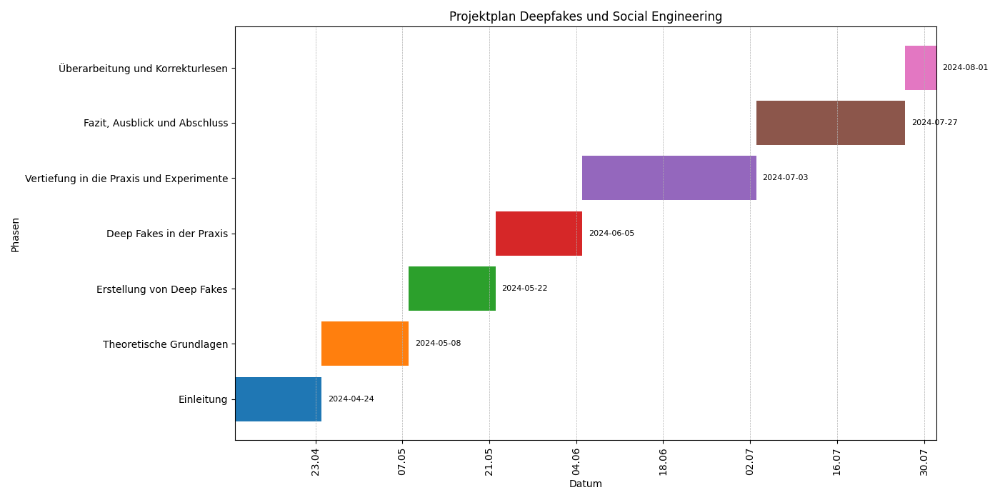

# Deepfakes und Social Engineering

## 1. Einleitung
- Definition und historischer Hintergrund von Deep Fakes
- Überblick über Social Engineering und dessen Bedeutung in der Cybersecurity
- Zielsetzung der Projektarbeit und Relevanz des Themas

## 2. Theoretische Grundlagen
- **Einführung in Deep Fakes**
  - Wie funktionieren Deep Fakes? Technische Grundlagen
  - Anwendungsgebiete von Deep Fakes außerhalb von Social Engineering
  - Ethikrichtlinien für die Erstellung und Verwendung von Deep Fakes in der Forschung

- **Social Engineering: Definition, Methoden und Ziele**
  - Psychologische Aspekte von Social Engineering
  - Beispiele für Social Engineering Attacken

## 3. Erstellung von Deep Fakes
- Auswahl der Werkzeuge und Software für die Erstellung von Deep Fakes
- Schritt-für-Schritt-Anleitung zur Erstellung von Deep Fakes
  - Bilder
  - Videos
  - Stimmen

## 4. Deep Fakes in der Praxis von Social Engineering
- Analyse, wie Deep Fakes Social Engineering-Angriffe verstärken können
  - Beispiele für potenzielle Angriffsszenarien
- Fallstudien: Bekannte Fälle von Deep Fake-basierten Social Engineering-Angriffen

## 5. Experimente und Übungen
  - Biometrische Authentifizierungssysteme und ihre Anfälligkeit für Deep Fakes
  - Durchführung von Social Engineering-Angriffen mit Hilfe von Deep Fakes
    - Stimmenimitation
    - Video Stellungnahmen von Vorgesetzten durch Deep Fake
    - Erpressung durch gefälschte Bilder

## 6. Fazit und Ausblick
- Die Rolle der KI in der Zukunft von Social Engineering und Cybersecurity
- Zusammenfassung der wichtigsten Erkenntnisse der Arbeit

## Projektplan
